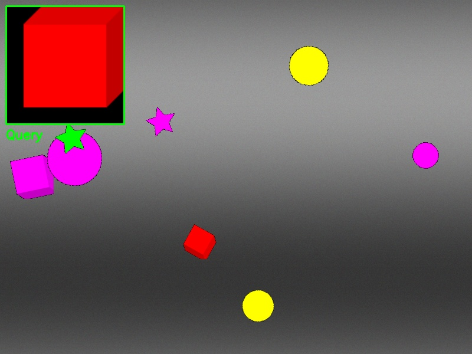

1. Input Image
   ↓
2. Segmentation
   - Detect objects/regions in the image
   - Extract bounding boxes (x, y, width, height)
   ↓
3. Embedding Extraction
   - Crop each segment from original image
   - Pass through CLIP/DINOv2 model
   - Get 512/768-dimensional vector for each segment
   ↓
4. Index Storage
   - Store embeddings in FAISS index
   - Store metadata (which image, bounding box coordinates)

## visual_search_mvp (layout first try)

## visual_search_mvp2 (layout second try, different method) -  **Failed**

